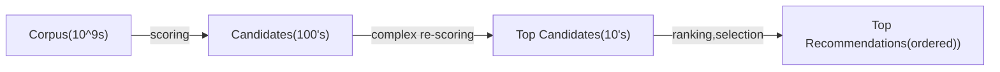
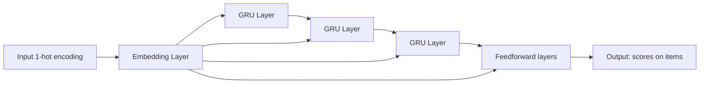

# Why Recsys?

Item space, user space.
Very high value to customer and commercial.
Items can be other users too, i.e. tinder.

# References
[Matrix Factorization Report](https://pdfs.semanticscholar.org/b474/56864177f79b0ef1b00ac923527aac256ffc.pdf).

# Requirements
## Functional
 Enjoyable content
 Increasing Revenue
 Fairness (across demographic strata)
 Fairness (across items)
 Diversity of content (serendipity)

## Non-functional
* Availability
* Low latency

# System Overview

## Scalability Concern 1

# High-level description on priorities/ ML approach at each stage above
# First Pass ^candidate_generation
To get from __Corpus__ to __Candidates__

quick-ish models, fast collaborative filtering,etc.

KNN w/ random projection or local hashing, etc.
[[science.math.Functional Analysis.High Dimensional Neighborhood Search]]
[[science.math.Functional Analysis.High Dimensional Neighborhood Search.Random Projections]]

# Second Pass

Bigger models, use everything possible, user activity etc.
[possible recsys architectures](https://d2l.ai/chapter_recommender-systems/index.html).

All tricks about cold start, session models, etc also come here.

# Third pass re-Ranking

Add constraints (already seen this item, has clicked 'not interested' on similar, etc).
Add freshness, fairness, diversity.
Maybe use some linear programming or other stuff to optimize something close to business objective.

# Data

## User features:

login date, demographics

## Item features

Item content features- description, publisher, category, images, video snapshots. Tags, publisher tags,
tags from image/video object detection algos, etc.

# Item-user Interaction 
* Rating
* Purchase
* Other stuff

# Feature Engineering
* Normalization of ratings

## Implicit and Explicit Signals, combining them ^implicit-explicit signal

Summary:
implicit feedback based models seem better for ranking predictions, much richer, but if
basing only on implicit feedback, might have popularity bias.
![[science.stats.Regression.Recommender Systems#^popularity-bias-implicit]]

 Metrics
* 
![[science.stats.Regression.Loss Functions#^ranking-start]]
![[science.stats.Regression.Loss Functions#^ranking-start:#^ranking-end]]

# Item-item or user-user based similarity (content-based filtering) ^content-filtering
## Data:
Movie profile:
* Genre
* Producer
* Tags
* Description (word2vec,doc2vec)
* Images and video snapshots (maybe tagging based on that, maybe color pallet)
* Thumbnails
<!-- * User search/interest history -->

Maybe latent space of 'interests' that's common to not only this recsys, but
the search as well...

# Item-user based similarity (collaborative filtering) ^collaborative-filtering

# Models ^models
## Item-Item Similarity ^item-item-similarity

* Item KNN
* Item Attr
* BPRMF
* ItemKNN
* Item Attribute KNN
* UserKNN
* User Attribute KNN
* Group-based (Clustering-based algorithm)
* Paco Recommender (Co-Clustering-based algorithm)

# Algorithms ^algorithms

For content filtering approaches:

Clustering type things, manifold dimensionality reduction, etc. General unsupervised learning techniques.
[[science.stats.Unsupervised Learning]] 
[[science.stats.Unsupervised Learning.KNN]] 

## Collaborative Filtering ^collaborative-filtering

## Item-User Embedding (Collaborative Filtering)) ^collaborative-filtering-models
* Matrix Factorization (with and without baseline)
* Non-negative Matrix Factorization
* SVD
* SVD++
* ItemKNN

## Optimization Techniques ^optimization-techniques
### Stochastic Gradient Descent ^sgd

[[science.math.Optimization.Stochastic Gradient Descent]]

### Alternating Least Squares ^als

Note in ![[science.stats.Regression.Recommender Systems#^svd-loss2]] 
we're optimizing wrt $p,q,b$. 
The loss is not convex, BUT if we fix $p,b$ we can optimize wrt $q$ with least squares.
Same for fixing $q,b$ -$p$ and $q,p$, which means we can have a sequence of solving quadratic (and I think in this case, convext) problems.

 Advantages:
 massive parallelization, as if we have only the $p,q$ case, the objective function decomposes across variables!!!
 But depends on the objective itself.

# Cold Start Problem
New (or unknown) users or  items.

## New Item
 No historical interaction data.
 Typically use item data or baselines.

* Use item-item model, based on content (item-similarity for current item) [[^item-item-similarity]]

## New User

Unseen or anonusers - no profile or historical interactions. 

### User-user model, based on demographic characteristics

###  Anonimous Users
 
 If no profile, start showing items (Akinator-style)[https://en.akinator.com/] somehow and try to represent the user a s linear combination of the items seen.

## No collaborative filtering

Item-similarity
Contextual models for short-term history.

### Intra-session models
From [this video](https://youtu.be/y_TzOOCJqxI?t=1066), we get a session-based recommendation
using such architecture:

uses [[science.math.Optimization.Optimizers In in Neural Networks.Negative Sampling]],#minibatch.

[[science.stats.Regression.Metrics:^ranking-start:^ranking-end]]: BPR, TOP1.

### But in fact neighborhood based Methods are not much worse if done properly
[Debunk on the 20-30% of the last paragraph](https://web-ainf.aau.at/pub/jannach/files/Conference_RecSys_2017.pdf)

## Representing user as linear combination of items

# Discrepency between 'business goal metric' and 'within-optimizer loss'

Can have variety of final allocators.

# Fairness ^fairness
[[Philosophy and Rationality.Algorithmic Fairness]]
## Error is same across groups

![[Philosophy and Rationality.Algorithmic Fairness#^independence-formula]]

Can either model directly or just train algo and then test if erros same (ANOVA, t-test variations etc).

# Keeping Track and serving of multiple models, model versions, A/B/C/D... testing,rollbacks
## Data Structure for multiple models

## A/B/C/D testing 

## Model Rollback

## Train-test set splitting

Probably similar to how we split data for testing in [[science.stats.Deep Neural Networks.Graph Neural Networks]]

![[science.stats.Train Test Splitting#^recsys-start]]
[[science.stats.Train Test Splitting]]

# Moderation

Remove, reduce, inform approach.

## Remove

As users upload stuff, it's put in a [[engineering.technologies.Message Queues]] and pool of workers
is processing it for violation of Community standards, forbidden content, abuse, etc.
If confidence is high >99.5%, say, can directly remove.

## Reduce

Can send stuff above certain threshold for manual moderation. Can have buttons to report, etc,
gain more feedback about it.
 Threats, etc.

## Inform

Can match clickbait titles, if we detect topic or semantics of a title/article, can check agains 
3rd party fact-checkers.

# Quick Filtering Tricks  ^filters

Some fast algorithms for deleting items for consideration for a certain query.

### Bloom Filters for deleting forbidden Items
[[science.CS.algos.Data Structures.Bloom Filters#use-in-recommendation-systems]]
Usage- mostly first-pass.
### Exclusion of 'too similar' items from same newsfeed
This looks vaguely like [[science.math.modelling.Operations Research.Facility Location]], or
[[science.stats.Unsupervised Learning.Clustering]] problem. Can, though, solve approximately by a greedy approach where we pick an item and remove from consideration items too similar to it, until correlation/cosine similarity is low enough, pick next item, etc. Always pick the next thing that's dissimilar enough from the previous ones.

See also (Greedy 2-approximation for k-center)[https://ugtcs.berkeley.edu/src/approx-sp19/scribe-notes-2.pdf].

Usage-mostly first pass.

#  Privacy and GDPR
![[Philosophy and Rationality.Algorithmic Privacy, Right to be Forgotten#^gdpr:#^gdpr-end]]

# Model Serving 
Tricky, thus the multi-step process.

# Future Directions

# Improved RNN's : cold starts and session models

# curther research on contextual models, as well as content and metadata.

# Combining sequence and historical data (long and short term behavior)
