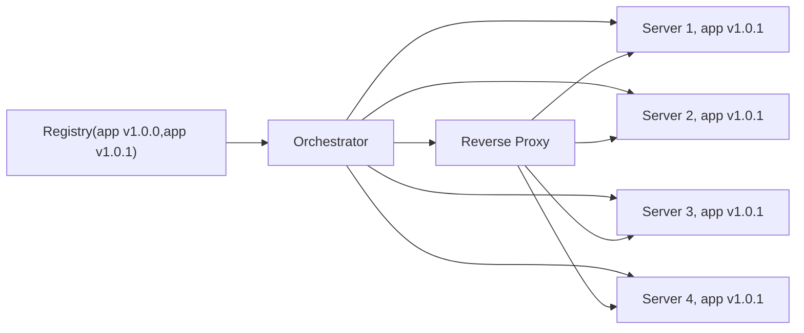

These are rough notes from the Educative Tools

# Why Docker

Problem:
dependency, environment managementm

Scaling 

Updates

# Basics

* Container- isolated instance of a running VM.
* Image 'recipe' for building a container. 
* Registry - Repository for imates.

Can run containers from existing images.
Can craete new images.
Can upload images to registries

# Orchestrator and updates

## Scale-up

[[engineering.technologies.Proxy and Reverse Proxy]]

#TODO Question: does the reverse proxy talk to the orchestrator??

## Updates

An orchestrator is something that sits in front of a bunch of containers of the same type and:
1. Redirects traffic to the correct container.
2. Runs more or deletes containers
3. Updates containers by a schedule (?)...

So probably docker allows "seamless" updates via it's orchestrator..

**Solves  dependency conflicts- every container is 'born' to run tightly coupled set of applications/services.**. Most of the time it will be a single application.

