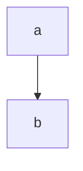

## Leetcode Problems

### [1. Two Sum](https://leetcode.com/problems/two-sum/)

$x$
$$
\begin{align}
    x=2
\end{align}
$$

# [Max Distance to closest person](https://leetcode.com/problems/maximize-distance-to-closest-person/)
Solved w/ O(n) space...
#TODO
Check this solution:

2: Two Pointer [Accepted]
Intuition

As we iterate through seats, we'll update the closest person sitting to our left, and closest person sitting to our right.

Algorithm

Keep track of prev, the filled seat at or to the left of i, and future, the filled seat at or to the right of i.

Then at seat i, the closest person is min(i - prev, future - i), with one exception. i - prev should be considered infinite if there is no person to the left of seat i, and similarly future - i is infinite if there is no one to the right of seat i.

# [Word Pattern](https://leetcode.com/problems/word-pattern/)

Very stupid, solved w/ the 2 hash map approach