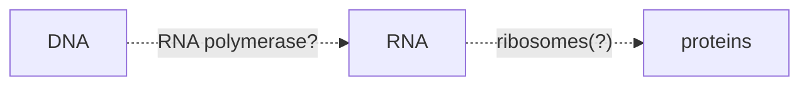

Adenine

Thymine - in RNA replaced by u-uracil

cysteine

Guanine

----

Size of folded DNA grows as $O(\sqrt{N})$ of the length of the sequence. Random walk argument. If angles are random, that would be the expected length

*Disulfide bridges* - bonds between 2 strands of DNA that are not complimentary.
2 C AA would come together to staple the protein anf fold it together..

Native folds- one configuration occurs very often. Stable configurations...

Thermodynamic hypothesis - not onlythe C proteins, but all AA's in the protein together determine it's native fold...

Why was alcohol interfering witht the thing finding it's correct fold,though??

Like heat, alcohol breaks protein fold...

Different bonds hold different amount of energy, so counting bonds is not an acceptable way to estimate energy...

# PCR, Genome reading, etc

## PCR is doubleing a piDNA