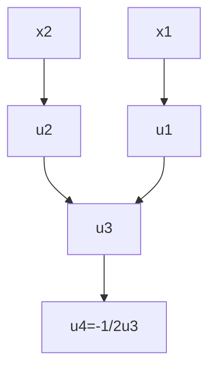

References: [Matlab site](https://www.mathworks.com/help/deeplearning/ug/deep-learning-with-automatic-differentiation-in-matlab.html).

# Automatic Differentiation

$x_1 exp(-\frac{1}{2}(x_1^2+x_2^2)).$

# Forward Mode Differentiation

# Reverse Mode Differentiation
