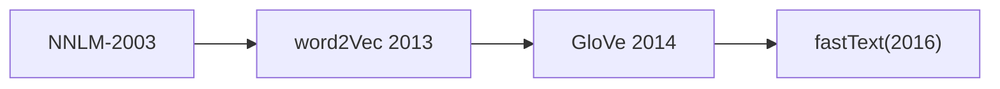

From [this medium article](https://towardsdatascience.com/a-no-frills-guide-to-most-natural-language-processing-models-part-1-the-pre-lstm-ice-age-86055dd5d67c)
Pre- LSTM Dark Age

```mermaid
graph LR;
a[NNLM-2003] --> b[word2Vec 2013]--> c[GloVe 2014]-->d["fastText(2016)"]
```

# Seq2Seq 